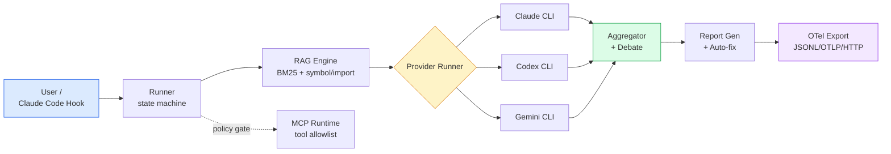
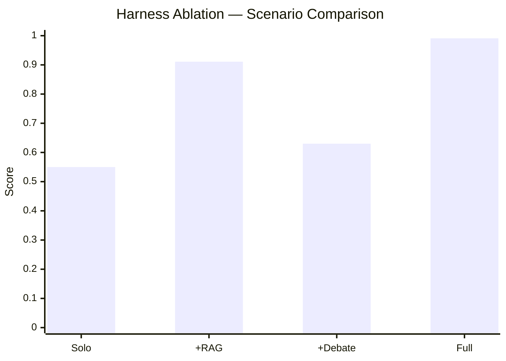

# AI Review Arena

AI Review Arena는 여러 AI 코드 리뷰어를 CLI 기반으로 실행하고, 로컬 RAG 근거를 붙이며, deterministic benchmark와 live provider sample로 결과를 비교하는 리뷰 하네스입니다. Claude Code, Codex, Gemini CLI 워크플로에 연결할 수 있는 설정 파일도 생성합니다.

이 프로젝트는 hosted provider API를 기본 전제로 삼지 않습니다. 실제 실행 경로는 로컬에 설치된 CLI 도구를 사용하는 구조입니다.

## 주요 기능

- Codex, Gemini, Claude 지향 리뷰 플로우를 typed Python runtime으로 실행합니다.
- BM25, symbol, import, changed-file, file-hint scoring 기반으로 로컬 evidence chunk를 검색합니다.
- finding마다 evidence chunk를 붙여 최종 report에서 근거를 확인할 수 있게 합니다.
- severity calibration, retrieval recall, harness ablation, live provider sample을 benchmark합니다.
- tracing, cost, latency, tool call, RAG, debate, aggregation, report, benchmark, auto-fix 단계의 structured event를 남깁니다.
- OpenTelemetry-compatible JSONL, OTLP JSON export, HTTP collector push를 지원합니다.
- MCP allowlist와 side-effect approval을 적용한 MCP tool-call wrapper와 JSON-RPC stdio server를 제공합니다.
- 명시적으로 설치하면 Claude Code hook과 agent 파일을 현재 프로젝트에 연결합니다.

## 아키텍처



Runner는 phase·retry·timeout·error recovery를 소유하는 typed Python state machine입니다. CLI provider는 격리된 어댑터로 동작하고, RAG는 외부 벡터 스토어 없이 프로젝트 트리에서 로컬로 동작합니다. MCP tool 호출은 allowlist + side-effect approval 정책 게이트를 통과해야 합니다.

## 런타임 구조

현대화된 런타임은 `arena_runtime/`에 있고 진입점은 다음 하나입니다.

```bash
python3 scripts/arena-runtime.py <command> [args]
```

Shell은 더 이상 오케스트레이션 레이어가 아닙니다. 남아 있는 shell 파일은 테스트 또는 개발 지원용이며 리뷰 런타임의 중심 경로가 아닙니다.

핵심 파일:

- `arena_runtime/entrypoint.py`: command dispatch.
- `arena_runtime/provider_runner.py`: CLI provider adapter.
- `arena_runtime/rag_runtime.py`: evidence retrieval.
- `arena_runtime/benchmarking.py`: deterministic/live benchmark.
- `arena_runtime/harness.py`: event bus와 OTel export/push.
- `arena_runtime/mcp_runtime.py`: MCP tool-call wrapper와 stdio server.
- `arena_runtime/exporters.py`: Claude, Codex, Gemini integration export.
- `config/default-config.json`: 기본 모델, 정책, RAG, benchmark, MCP 설정.

## 빠른 시작

체크아웃에서 패키지 설치:

```bash
python3 -m pip install -e .
arena validate-config config/default-config.json
```

설정 검증:

```bash
python3 scripts/arena-runtime.py validate-config config/default-config.json
```

live model 호출 없이 CLI 상태 확인:

```bash
arena cli-diagnostics --config config/default-config.json
arena provider-smoke --models codex,gemini,claude --timeout 30
```

RAG index와 evidence retrieval:

```bash
python3 scripts/arena-runtime.py rag-indexer . --config config/default-config.json
python3 scripts/arena-runtime.py rag-evidence . security "credential handling" --config config/default-config.json --top-k 5
```

Deterministic benchmark:

```bash
python3 scripts/arena-runtime.py retrieval-benchmark --config config/default-config.json --max-cases 3
python3 scripts/arena-runtime.py benchmark-harness-ablation --config config/default-config.json --max-cases 3
```

Codex/Gemini CLI가 설치되고 인증된 환경에서 bounded live sample 실행:

```bash
arena benchmark-models --category security --models codex,gemini --live --smoke --timeout 90 --preflight-timeout 30 --require-live-success
```

## 제품 문서

- [Installation](docs/installation.md)
- [First review in 5 minutes](docs/first-review.md)
- [Provider setup](docs/provider-setup.md)
- [Security model](docs/security-model.md)
- [Troubleshooting](docs/troubleshooting.md)
- [Dashboard](docs/dashboard.md)
- [Release process](docs/release-process.md)

## Claude Code 연결

Claude Code 연결은 프로젝트별로 명시적으로 설치해야 합니다.

```bash
python3 scripts/arena-runtime.py install-claude-integration --project-root .
```

이 명령은 `.claude/settings.json`과 `.claude/agents/*.md`를 생성합니다. 이후 Claude Code가 해당 프로젝트 설정을 로드하면 hook을 통해 Arena가 실행될 수 있습니다. 전역 백그라운드 서비스가 아니며, 설정이 없는 Claude Code 세션에 자동으로 개입하지 않습니다.

Agent 파일 정책:

- `.claude/agents/`는 Claude Code runtime install target입니다.
- `.codex/agents/`는 Codex 지향 runtime install target입니다.
- `agents/`는 exporter나 문서에서 명시적으로 참조될 때만 shared/historical reviewer material로 취급합니다.
- `.claude/agents/`의 생성물을 직접 고치면 다음 export 때 덮일 수 있습니다. 장기 반영이 필요한 내용은 exporter source나 shared reviewer material에 반영합니다.

## Codex와 Gemini 연결

지원되는 CLI 생태계용 integration 파일 생성:

```bash
python3 scripts/arena-runtime.py export-extension all --output-dir ./dist/extensions
```

Export는 설정과 command definition을 생성합니다. 실제 리뷰 실행은 로컬 Codex, Gemini, Claude 도구가 설치, 인증, `PATH` 노출까지 되어 있어야 가능합니다.

## MCP runtime

정책이 적용된 단일 tool call:

```bash
python3 scripts/arena-runtime.py mcp-tool-call --config config/default-config.json --server local --tool echo --input-json '{"ok":true}'
```

JSON-RPC stdio server mode:

```bash
python3 scripts/arena-runtime.py mcp-stdio-server --config config/default-config.json
```

MCP runtime은 `mcp.servers`에 설정되고 `mcp.allowed_tools` / `mcp.side_effect_tools` 정책을 통과한 도구만 노출합니다. Side-effect tool은 명시적 approval이 필요합니다.

## Observability

Harness event 기록:

```bash
python3 scripts/arena-runtime.py harness-event review.started --phase review --field provider=codex
```

JSONL 또는 OTLP JSON export:

```bash
python3 scripts/arena-runtime.py otel-export --run-dir cache/runs/<run-id> --output trace.jsonl
python3 scripts/arena-runtime.py otel-export --run-dir cache/runs/<run-id> --format otlp-json --output trace.otlp.json
```

Collector endpoint로 push:

```bash
python3 scripts/arena-runtime.py otel-push --run-dir cache/runs/<run-id> --endpoint http://127.0.0.1:4318/v1/traces
```

## Benchmark 결과 (실측)

`benchmark-harness-ablation`으로 측정한 ablation 결과 (3 cases, 2026-05-09):

| 시나리오 | RAG | Debate | Harness Score |
|----------|-----|--------|---------------|
| `review_only` (Solo) | – | – | **0.55** |
| `review_plus_rag` | ✅ | – | 0.911 |
| `review_plus_debate` | – | ✅ | 0.63 |
| **`full_harness`** | ✅ | ✅ | **0.991** |



RAG가 단일 요인으로 가장 큰 기여 (Solo 대비 +0.36). Full harness는 Solo 대비 **+0.44** 점프하여 0.991 도달.

Retrieval benchmark (BM25 + symbol/import/changed-file/file-hint scoring):

| Test ID | Category | Recall@k | MRR | Hits |
|---------|----------|----------|-----|------|
| retrieval-extension-01 | architecture | 1.000 | 1.000 | 1/1 |
| retrieval-harness-01 | architecture | 1.000 | 1.000 | 1/1 |
| retrieval-security-01 | security | 1.000 | 0.625 | 2/2 |
| **Aggregate** | | **1.000** | **0.875** | **4/4** |

로컬 재현:

```bash
python3 scripts/arena-runtime.py retrieval-benchmark --config config/default-config.json --max-cases 10
python3 scripts/arena-runtime.py benchmark-harness-ablation --config config/default-config.json --max-cases 10
```

## Benchmark 전략

Arena는 deterministic harness 검증과 live model 검증을 분리합니다.

- Deterministic test는 schema, RAG attachment, aggregation, report, retrieval fixture, OTel export, MCP boundary를 검증합니다.
- Retrieval benchmark는 dedicated fixture 기준 expected-file recall과 MRR을 측정합니다.
- Harness ablation은 RAG, boundary, evidence attachment, aggregation 유무에 따른 차이를 봅니다.
- Live provider sample은 로컬 CLI가 인증, 업데이트, 네트워크, interactive prompt로 막힐 수 있으므로 timeout, case count, model list로 제한합니다.

## 검증

Targeted runtime check:

```bash
python3 -m compileall arena_runtime scripts/arena-runtime.py
bash tests/unit/test-harness-rag-runtime.sh
bash tests/unit/test-generate-report.sh
python3 scripts/arena-runtime.py retrieval-benchmark --config config/default-config.json --max-cases 3
```

전체 suite:

```bash
bash tests/run-tests.sh --all
```

## 보안 경계

Arena는 외부 모델 출력, RAG chunk, MCP tool input을 모두 untrusted data로 취급합니다. Runtime policy는 다음을 다룹니다.

- retrieved context의 prompt-injection 탐지;
- MCP tool allowlist;
- side-effect approval gate;
- configured tool call의 restricted subprocess environment;
- finding/report의 evidence metadata.

이 경계는 위험을 줄이는 장치이며, destructive 또는 high-impact action에 대한 사람의 승인을 대체하지 않습니다.
