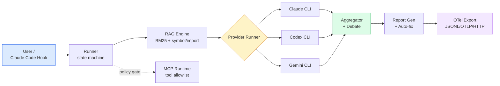
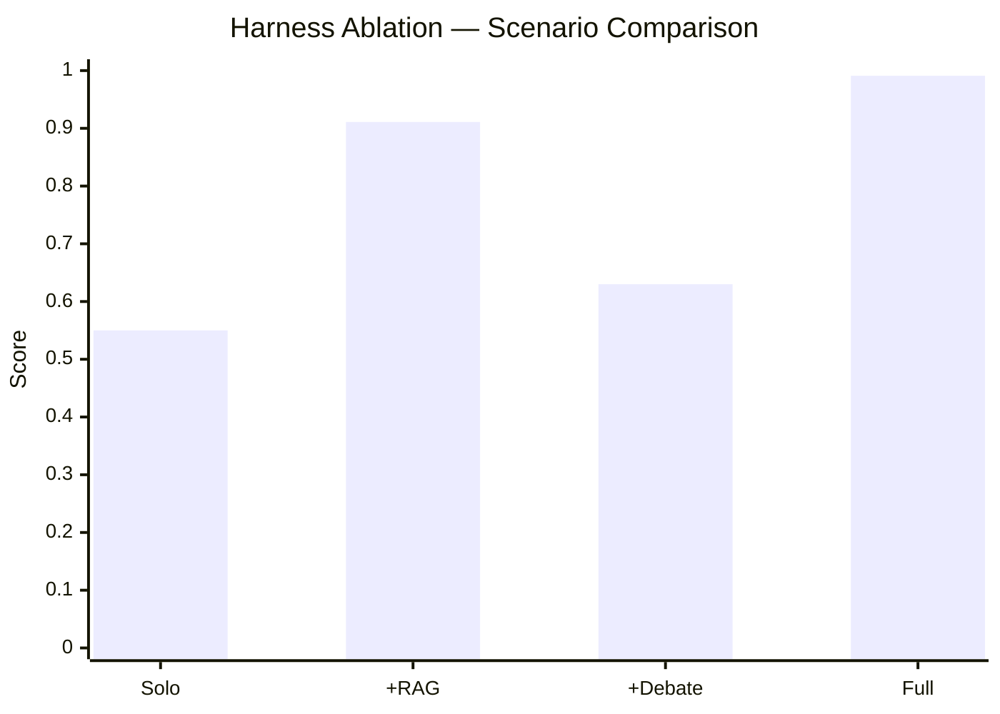

# AI Review Arena

AI Review Arena is a CLI-first review harness for running multiple AI code reviewers, attaching local RAG evidence, comparing results with deterministic benchmarks, and exporting integration files for Claude Code, Codex, and Gemini CLI workflows.

The project does not depend on hosted provider APIs. Provider execution is intentionally CLI-based so it can run with the same tools a developer already uses locally.

## What it does

- Runs Codex, Gemini, and Claude-oriented review flows through a typed Python runtime.
- Retrieves local evidence chunks with BM25, symbol, import, changed-file, and file-hint scoring.
- Attaches evidence chunks to findings so reports can show why a finding was produced.
- Benchmarks severity calibration, retrieval recall, harness ablations, and live provider samples.
- Emits structured harness events for tracing, cost, latency, tool calls, RAG, debate, aggregation, report generation, benchmark, and auto-fix phases.
- Exports OpenTelemetry-compatible JSONL or OTLP JSON, and can push OTLP JSON to an HTTP collector endpoint.
- Provides a policy-gated MCP runtime, including a JSON-RPC stdio server for configured MCP tools.
- Installs Claude Code hooks and agent files for project-local integration when explicitly enabled.

## Architecture



The runner is a typed Python state machine that owns phases, retries, timeouts, and error recovery. CLI providers are isolated adapters. RAG runs locally over the project tree (no external vector store). MCP tool calls pass through a policy gate with allowlist and side-effect approval.

## Runtime model

The modern runtime lives in `arena_runtime/` and is entered through:

```bash
python3 scripts/arena-runtime.py <command> [args]
```

Shell is not used as the orchestration layer. Remaining shell files are tests or developer support scripts, not the review runtime.

Core areas:

- `arena_runtime/entrypoint.py`: command dispatch.
- `arena_runtime/provider_runner.py`: CLI provider adapters.
- `arena_runtime/rag_runtime.py`: evidence retrieval.
- `arena_runtime/benchmarking.py`: deterministic and live benchmark commands.
- `arena_runtime/harness.py`: event bus and OTel export/push.
- `arena_runtime/mcp_runtime.py`: MCP tool-call wrapper and stdio server.
- `arena_runtime/exporters.py`: Claude, Codex, and Gemini integration exports.
- `config/default-config.json`: default model, policy, RAG, benchmark, and MCP settings.

## Quick start

Install the package from a checkout:

```bash
python3 -m pip install -e .
arena validate-config config/default-config.json
```

Validate the local configuration:

```bash
python3 scripts/arena-runtime.py validate-config config/default-config.json
```

Run CLI diagnostics without calling live models:

```bash
arena cli-diagnostics --config config/default-config.json
arena provider-smoke --models codex,gemini,claude --timeout 30
```

Index and retrieve local RAG evidence:

```bash
python3 scripts/arena-runtime.py rag-indexer . --config config/default-config.json
python3 scripts/arena-runtime.py rag-evidence . security "credential handling" --config config/default-config.json --top-k 5
```

Run deterministic benchmark paths:

```bash
python3 scripts/arena-runtime.py retrieval-benchmark --config config/default-config.json --max-cases 3
python3 scripts/arena-runtime.py benchmark-harness-ablation --config config/default-config.json --max-cases 3
```

Run a bounded live provider sample when the CLIs are installed and authenticated:

```bash
arena benchmark-models --category security --models codex,gemini --live --smoke --timeout 90 --preflight-timeout 30 --require-live-success
```

## Product docs

- [Installation](docs/installation.md)
- [First review in 5 minutes](docs/first-review.md)
- [Provider setup](docs/provider-setup.md)
- [Security model](docs/security-model.md)
- [Troubleshooting](docs/troubleshooting.md)
- [Dashboard](docs/dashboard.md)
- [Release process](docs/release-process.md)

## Claude Code integration

Claude Code integration is project-local and explicit. Install the hook and agent files into the current project with:

```bash
python3 scripts/arena-runtime.py install-claude-integration --project-root .
```

This writes `.claude/settings.json` and `.claude/agents/*.md`. After that, Claude Code can trigger Arena through the configured hooks for this project. It is not a global background service and it does not intercept Claude Code sessions unless the project hook configuration is present and loaded by Claude Code.

Agent file policy:

- `.claude/agents/` is the Claude Code runtime install target.
- `.codex/agents/` is the Codex-oriented runtime install target.
- `agents/` is treated as shared or historical reviewer material only when explicitly referenced by exporters or docs.
- Avoid hand-editing generated files in `.claude/agents/` if the same change should apply to future exports. Update the exporter source or shared reviewer material instead.

## Codex and Gemini integration

Export integration files for supported CLI ecosystems:

```bash
python3 scripts/arena-runtime.py export-extension all --output-dir ./dist/extensions
```

Exports are configuration files and command definitions. Actual review execution still depends on the local Codex, Gemini, or Claude tooling being installed, authenticated, and available in `PATH`.

## MCP runtime

Direct policy-gated tool call:

```bash
python3 scripts/arena-runtime.py mcp-tool-call --config config/default-config.json --server local --tool echo --input-json '{"ok":true}'
```

JSON-RPC stdio server mode:

```bash
python3 scripts/arena-runtime.py mcp-stdio-server --config config/default-config.json
```

The MCP runtime only exposes tools configured under `mcp.servers` and constrained by `mcp.allowed_tools` / `mcp.side_effect_tools`. Side-effect tools require explicit approval.

## Observability

Emit a harness event:

```bash
python3 scripts/arena-runtime.py harness-event review.started --phase review --field provider=codex
```

Export events as JSONL or OTLP JSON:

```bash
python3 scripts/arena-runtime.py otel-export --run-dir cache/runs/<run-id> --output trace.jsonl
python3 scripts/arena-runtime.py otel-export --run-dir cache/runs/<run-id> --format otlp-json --output trace.otlp.json
```

Push OTLP JSON to a collector endpoint:

```bash
python3 scripts/arena-runtime.py otel-push --run-dir cache/runs/<run-id> --endpoint http://127.0.0.1:4318/v1/traces
```

## Benchmark Results (measured)

Harness ablation result from `benchmark-harness-ablation` (3 cases, 2026-05-09):

| Scenario | RAG | Debate | Harness Score |
|----------|-----|--------|---------------|
| `review_only` (Solo) | – | – | **0.55** |
| `review_plus_rag` | ✅ | – | 0.911 |
| `review_plus_debate` | – | ✅ | 0.63 |
| **`full_harness`** | ✅ | ✅ | **0.991** |



RAG is the largest single contributor (+0.36 over Solo). Full harness reaches 0.991 — a +0.44 jump from Solo review.

Retrieval benchmark (BM25 + symbol/import/changed-file/file-hint scoring):

| Test ID | Category | Recall@k | MRR | Hits |
|---------|----------|----------|-----|------|
| retrieval-extension-01 | architecture | 1.000 | 1.000 | 1/1 |
| retrieval-harness-01 | architecture | 1.000 | 1.000 | 1/1 |
| retrieval-security-01 | security | 1.000 | 0.625 | 2/2 |
| **Aggregate** | | **1.000** | **0.875** | **4/4** |

Reproduce locally:

```bash
python3 scripts/arena-runtime.py retrieval-benchmark --config config/default-config.json --max-cases 10
python3 scripts/arena-runtime.py benchmark-harness-ablation --config config/default-config.json --max-cases 10
```

## Benchmarking strategy

Arena separates deterministic harness validation from live model validation.

- Deterministic tests verify schema handling, RAG attachment, aggregation, reports, retrieval fixtures, OTel export, and MCP boundaries.
- Retrieval benchmarks measure expected-file recall and mean reciprocal rank against dedicated retrieval fixtures.
- Harness ablations compare review behavior with and without RAG, boundary checks, evidence attachment, and aggregation paths.
- Live provider samples are intentionally bounded by timeout, case count, and model list because local CLIs can block on auth, updates, network, or interactive prompts.

## Verification

Run targeted runtime checks:

```bash
python3 -m compileall arena_runtime scripts/arena-runtime.py
bash tests/unit/test-harness-rag-runtime.sh
bash tests/unit/test-generate-report.sh
python3 scripts/arena-runtime.py retrieval-benchmark --config config/default-config.json --max-cases 3
```

Run the full suite:

```bash
bash tests/run-tests.sh --all
```

## Security boundaries

Arena treats external model output, RAG chunks, and MCP tool inputs as untrusted data. Runtime policy covers:

- prompt-injection detection for retrieved context;
- MCP tool allowlists;
- side-effect approval gates;
- restricted subprocess environments for configured tool calls;
- evidence metadata in findings and reports.

These controls reduce risk but do not replace human approval for destructive or high-impact actions.
